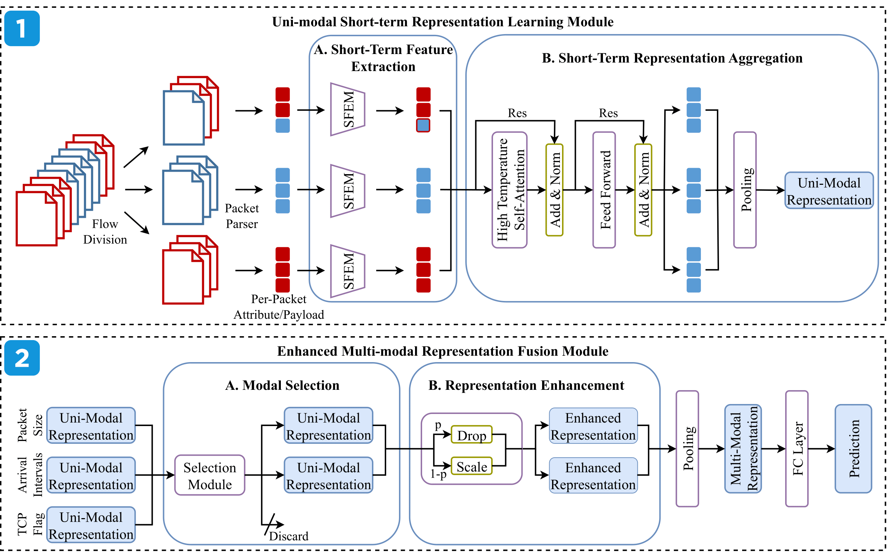

# AN-Net

This reposity is official implementation of:

***AN-Net: An Anti-Noise Network For Anonymous Traffic Classification***

In the 2024 ACM Web Conference (***WWW 2024***)


### Overview



We propose the Anti-Noise Network (AN-Net) to construct robust **short-term representations** for a single modality and then combine representations through **multi-modal fusion**.


### SetUp

```shell
conda create -n ANNet python=3.8
source activate ANNet
pip install torch==1.13.1+cu116 torchvision==0.14.1+cu116 torchaudio==0.13.1 --extra-index-url https://download.pytorch.org/whl/cu116
pip install scapy
pip install tqdm
pip install scipy==1.8.1
pip install scikit-learn
pip install matplotlib
pip install timm==0.4.12
```


### Data

1. Dataset Download

   - Download [SJTU-AN21-Dataset](https://drive.google.com/file/d/1MJ2Elbd7eTKYD3GCe2HAW830QxAsmLkI/view?usp=sharing) and unzip it
   - Download the pcap files in *5-Active/* at [CIC-IOT-Dataset](http://205.174.165.80/IOTDataset/CIC_IOT_Dataset2022/Dataset/)

2. Data Preparation

   ``` shell
   python data_extract.py  # extract payload, packet size, internal arrival time, etc., from pcap files
   python add_noise.py  # inject noise into extracted information
   python data_process.py  # convert extracted information to formatted data
   ```

3. **Omit the above two steps** by downloading the formatted data at [Google Drive](https://drive.google.com/file/d/1ADg4B1G4nIpP9iBN-0LlS8WVeRzZSWyQ/view?usp=drive_link)


### Training

The pre-trained model of ETBert (compared method) can be download at [Google Drive](https://drive.google.com/file/d/1vTIQpyQT0W9MbLavL2_YSdYahqviCLtP/view?usp=sharing)

```shell
python -u main.py --dataset 0 --noise 0.0 --method ShortTerm
python -u main.py --dataset 0 --noise 0.0 --method Whisper
python -u main.py --dataset 0 --noise 0.0 --method Characterize
python -u main.py --dataset 0 --noise 0.0 --method Robust
python -u main.py --dataset 0 --noise 0.0 --method Flowlens
python -u main.py --dataset 0 --noise 0.0 --method AttnLSTM
python -u main.py --dataset 0 --noise 0.0 --method Fs-net
python -u main.py --dataset 0 --noise 0.0 --method ETBert

python -u main.py --dataset 0 --noise 0.5_TLS --method ShortTerm
python -u main.py --dataset 0 --noise 0.5_TLS --method Whisper
python -u main.py --dataset 0 --noise 0.5_TLS --method Characterize
python -u main.py --dataset 0 --noise 0.5_TLS --method Robust
python -u main.py --dataset 0 --noise 0.5_TLS --method Flowlens
python -u main.py --dataset 0 --noise 0.5_TLS --method AttnLSTM
python -u main.py --dataset 0 --noise 0.5_TLS --method Fs-net
python -u main.py --dataset 0 --noise 0.5_TLS --method ETBert

python -u main.py --dataset 0 --noise 0.5_SIM --method ShortTerm
python -u main.py --dataset 0 --noise 0.5_SIM --method Whisper
python -u main.py --dataset 0 --noise 0.5_SIM --method Characterize
python -u main.py --dataset 0 --noise 0.5_SIM --method Robust
python -u main.py --dataset 0 --noise 0.5_SIM --method Flowlens
python -u main.py --dataset 0 --noise 0.5_SIM --method AttnLSTM
python -u main.py --dataset 0 --noise 0.5_SIM --method Fs-net
python -u main.py --dataset 0 --noise 0.5_SIM --method ETBert

python -u main.py --dataset 0 --noise 0.75_TLS --method ShortTerm
python -u main.py --dataset 0 --noise 0.75_TLS --method Whisper
python -u main.py --dataset 0 --noise 0.75_TLS --method Characterize
python -u main.py --dataset 0 --noise 0.75_TLS --method Robust
python -u main.py --dataset 0 --noise 0.75_TLS --method Flowlens
python -u main.py --dataset 0 --noise 0.75_TLS --method AttnLSTM
python -u main.py --dataset 0 --noise 0.75_TLS --method Fs-net
python -u main.py --dataset 0 --noise 0.75_TLS --method ETBert

python -u main.py --dataset 0 --noise 0.75_SIM --method ShortTerm
python -u main.py --dataset 0 --noise 0.75_SIM --method Whisper
python -u main.py --dataset 0 --noise 0.75_SIM --method Characterize
python -u main.py --dataset 0 --noise 0.75_SIM --method Robust
python -u main.py --dataset 0 --noise 0.75_SIM --method Flowlens
python -u main.py --dataset 0 --noise 0.75_SIM --method AttnLSTM
python -u main.py --dataset 0 --noise 0.75_SIM --method Fs-net
python -u main.py --dataset 0 --noise 0.75_SIM --method ETBert
```


### Contact-Info

[Xianwen Deng](https://github.com/SJTU-dxw)
Email: 2594306528@sjtu.edu.cn


### Acknowledgement

This work is supported by SJTU-QI'ANXIN Joint Lab of Information System Security. We are grateful to anonymous reviews for their constructive comments to improve this paper.


### Citation

```bibtex
@inproceedings{
    anonymous2024annet,
    title={AN-Net: An Anti-Noise Network For Anonymous Traffic Classification},
    author={Deng, Xianwen and Wang, Yijun and Xue, Zhi},
    booktitle={The Web Conference 2024},
    year={2024}
}
```

